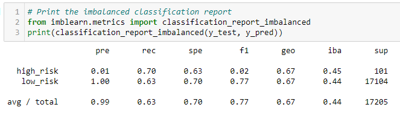
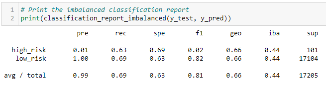

# Credit Risk Analysis
## Purpose
The purpose of this analysis is to evaluate credit card data from LendingClub. This analysis will determine which model of supervised machine learning best predicts a high-risk credit card applicant.

## Results
The below list indicates the accuracy, precision, and recall of all supervised machine learning models used to determine high-risk credit card applicants.
- RandomOverSampler
  - Accuracy: 0.66
  
  
  
  - Precision: 0.01
  - Recall: 0.70
  
  
  
- SMOTE
  - Accuracy: 0.66

  

  - Precision: 0.01
  - Recall: 0.63

  

- ClusterCentroids
  - Accuracy: 0.54

  

  - Precision: 0.01
  - Recall: 0.69

  

- SMOTEEN
  - Accuracy: 0.64

  

  - Precision: 0.01
  - Recall: 0.72

  

- BalancedRandomForestClassifer
  - Accuracy: 0.77

  

  - Precision: 0.03
  - Recall: 0.66

  

- EasyEnsembleClassifier
  - Accuracy: 0.93

   

  - Precision: 0.09
  - Recall: 0.92

  
  

## Summary
Overall, the ensemble supervised machine learning models performed the best. The BalancedRandomForestClassifier and the EasyEnsembleClassifier had the highest accuracies, precisions, and recalls of all of the models with the EasyEnsembleClassifier performing the best. I would recommend using the EasyEnsembleClassier as it has the best accuracy, precision, and recall scores. It has a particularly high recall score, which is important in this case as it is more important to catch all of the high-risk applicants than it is to be precise when analyzing credit risk. 
